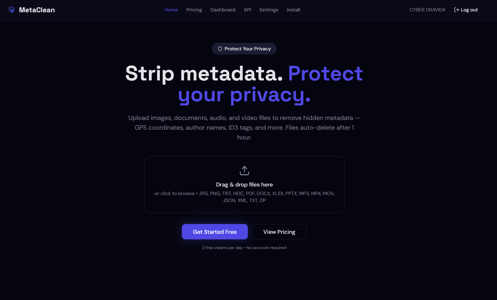

<div align="center">


# ✨ MetaClean

**Strip metadata. Protect privacy. Keep the file.**

*A powerful, client-side metadata cleaner for images, documents, audio, video, text, and ZIP archives.*

[](https://vite.dev/)
[](https://react.dev/)
[](https://www.typescriptlang.org/)
[](https://tailwindcss.com/)
[](https://supabase.com/)

<br />
<br />



</div>

---

## 🌟 Why MetaClean?

MetaClean is a modern, privacy-first metadata removal app built to help you sanitize files before sharing them. By processing core cleaning tasks **on-device**, your data stays secure.

* 🔒 **Privacy-First Flow:** Client-side processing ensures your files never leave your device for core cleaning.
* 🧠 **Smart Preservation:** Strips identifying metadata while preserving structural fields, ensuring your output remains completely usable.
* 📦 **Batch & Archive Support:** Upload multiple files at once or scan and clean nested workflows right inside `ZIP` archives.
* 📊 **Comprehensive Reporting:** Generate per-file audit summaries, batch audit downloads, and exportable PDF reports.
* 📱 **PWA Ready:** Installable, app-like experience for native-feeling utility across devices.

---

## 📁 Supported Formats

| Category | Formats |
| :--- | :--- |
| 🖼️ **Images** | `JPG`, `PNG`, `TIFF`, `HEIC` |
| 📄 **Documents** | `PDF`, `DOCX`, `XLSX`, `PPTX` |
| 🎬 **Media** | `MP3`, `MP4`, `MOV` |
| 📝 **Structured Text** | `JSON`, `XML`, `TXT` |
| 🗜️ **Archives** | `ZIP` (Batch processing) |

---

## 🚀 Quick Start

### Prerequisites
* Node.js `20+` (recommended)
* npm `10+`

### Installation

```bash
# 1. Install dependencies
npm install

# 2. Start the development server
npm run dev
```

### Available Scripts

| Command | Description |
| :--- | :--- |
| `npm run dev` | Start development server |
| `npm run build` | Build for production |
| `npm run build:dev` | Build with development mode enabled |
| `npm run lint` | Run ESLint across the codebase |
| `npm run preview` | Preview the production build locally |
| `npm test` | Run Vitest test suite |
| `npm run test:watch`| Run Vitest in watch mode |

---

## 📸 The Experience

### 🏠 Home Experience
* **Hero-led Landing:** Instant upload access right from the start.
* **Frictionless Flow:** A simple three-step process: *Upload ➔ Clean ➔ Download*.

### 🎛️ Dashboard
* **Intuitive UI:** Seamless drag-and-drop upload area with real-time scan status per file.
* **Batch Controls:** Clean single files or process entire batches simultaneously.
* **Data Lifecycle:** Clear visibility into expiry and retention for uploaded files.

### ☁️ Platform Layer
* **Supabase Backend:** Robust authentication and synchronized credit tracking.
* **Edge Functions:** Secure account deletion and optional AI-enhanced report insights.

---

## 🛠️ Tech Stack

* **Frontend:** React 18, TypeScript, Vite
* **UI & Styling:** Tailwind CSS, Radix UI, shadcn/ui components, Lucide Icons
* **State & Forms:** React Query, React Hook Form
* **Backend Services:** Supabase
* **Processing Libraries:** `exifr`, `pdf-lib`, `jszip`, `mp3tag.js`, `mp4box`, `heic2any`, `jspdf`
* **Testing:** Vitest, Testing Library

---

## 🏗️ Project Structure

<details>
<summary><b>Click to expand directory structure</b></summary>

```text
meta-eraser/
├─ public/                  # icons, manifest, public assets
├─ src/
│  ├─ components/           # app UI and reusable components
│  ├─ hooks/                # auth, toast, device hooks
│  ├─ integrations/         # Supabase client
│  ├─ lib/                  # metadata parsing, cleaning, reports, credits
│  ├─ pages/                # landing, dashboard, profile, settings, admin
│  └─ test/                 # Vitest setup and tests
├─ supabase/
│  └─ functions/            # edge functions
├─ package.json
└─ vite.config.ts
```

</details>

---

## 📈 Status & Roadmap

**Current Status:** Active. The project features a meaningful product surface, a clean `npm audit` (0 vulnerabilities), and successfully passing tests and production builds.

**Next Up / Good First Issues:**
- [ ] Resolve existing ESLint violations.
- [ ] Split heavy file-processing dependencies into smaller, lazy-loaded chunks to optimize bundle size.
- [ ] Expand test coverage beyond the placeholder examples.
- [ ] Add a `.env.example` template and comprehensive deployment notes.
- [ ] Document the Supabase schema and Edge Function architecture.
